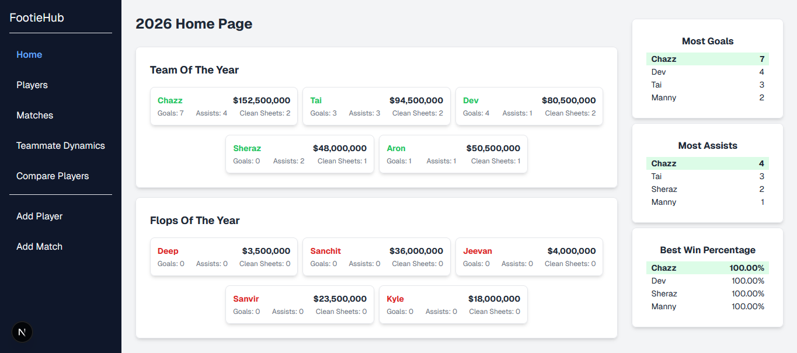
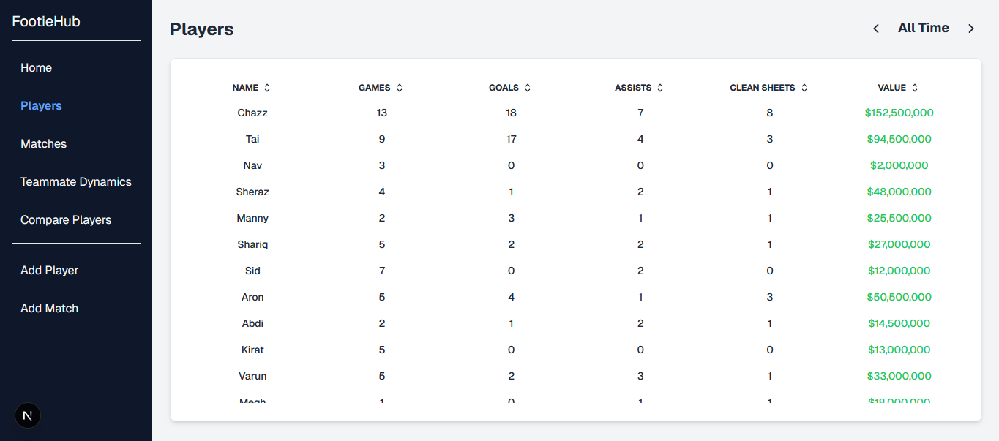
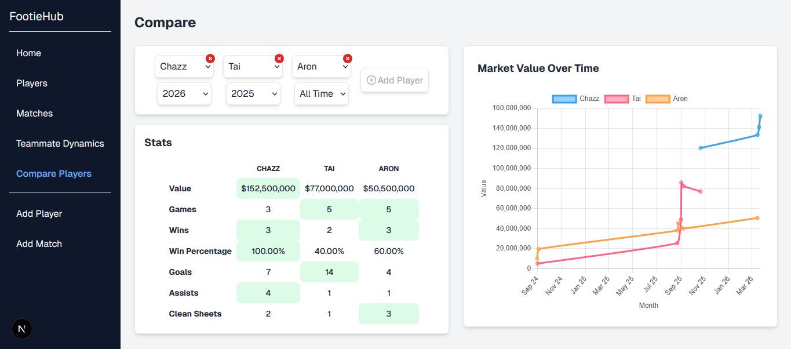

<div align="center">

# FootieHub

### Advanced Analytics for Grassroots Football

[](https://nextjs.org/)
[](https://react.dev/)
[](https://tailwindcss.com/)
[](https://www.mysql.com/)
[](https://www.chartjs.org/)
[](https://www.docker.com/)

**A high-performance Next.js application built to transform recreational soccer data into player and team insights.**

---

</div>

## Why I Built This

In recreational soccer, teams change every week. Without a formal league structure, individual contributions often go unrecorded, and "who makes the team better" remains a matter of opinion. 

I built **FootieHub** to bridge the gap between casual play and professional-grade analytics. I wanted to move beyond simple win/loss records to uncover the **hidden dynamics** of the pitch:
* **Teammate Synergy:** Identifying which combinations of players yield the highest goal contributions.
* **Performance Trends:** Visualizing personal growth and "market value" over time.
* **Data Integrity:** Building a reliable system to track goals, assists, and clean sheets across ever-changing team rosters.

This project was a deep dive into **relational data modeling** and **interactive data visualization**, ensuring that every match outcome and scoring contribution is captured as actionable, structured data.

---

## Screenshots

| Homepage |
|-----------|
|  |

| Players | Individual Player |
|-------|-----------|
|  |  |

| Compare | Teammate Performance |
|----------|--------------|
|  |  |

---

## Skills Demonstrated

| Domain | Technologies & Concepts |
|--------|-------------------------|
| **Frontend** | React 19, Next.js 15, Client/Server Components, Tailwind CSS |
| **Data Visualization** | Chart.js, Interactive Event Handling, Time-Series Visualization |
| **Backend & Logic** | Node.js, Docker, Server-Side Rendering, Error Handling, Data Access Object Pattern |
| **Database** | MySQL, Relational Schema Design, Many-to-Many Relationships, Data Aggregation |

---

## Features

<table>
<tr>
<td width="50%" valign="top">

### Performance Analytics
- Real-time G/A & Win% aggregation
- "All-Time" vs. Seasonal filtering
- Automated clean sheet attribution
- Dynamic doughnut chart snapshots

### Player & Match Management
- Dynamic Next.js URL routing
- Global player & match directories
- Responsive CRUD entry
- Multi-year data archiving

</td>
<td width="50%" valign="top">

### Player Comparison Tool
- 3-player side-by-side benchmarking
- Dynamic best-stat highlighting
- Comparative market value trends

### Teammate Synergy Tracking
- Relational scorer-assister mapping
- Success-correlation scatter plots
- Assist distribution analytics
- Multi-factor teammate ranking

</td>
</tr>
</table>

---

## Quick Start

### Prerequisites

- **Docker Desktop** ([Download](https://www.docker.com/products/docker-desktop/)) - Make sure it's **running**
- Ports 3000 and 3306 available

### Setup and Launch

```bash
# Clone the repository
git clone https://github.com/Chazz236/FootieHub.git
cd FootieHub

# Copy the environment example file (for Windows, use copy instead of cp)
cp .env.example .env

# Start all services
docker compose up --build
```

### Access the Application

| Service | URL | Description |
|---------|-----|-------------|
| **Frontend** | http://localhost:3000 | Next.js application |
| **Database** | localhost:3306 | MySQL Server |

---

## Project Structure

```
FootieHub/
├── README.md
├── Dockerfile
├── compose.yml
│
├── src/app/
│   ├── addMatch/            # Add match to db
│   ├── addPlayer/           # Add player to db
│   ├── compare/             # Compare player stats
│   ├── teammate/            # Synergy & contribution analysis
│   ├── matches/             # View all matches or by year
│   │   ├── [id]/            # View individual match details
│   ├── players/             # View all players and stats
│   │   ├── [id]/            # View individual player details
│   └── components/          # Reusable UI cards and charts
│
├── src/lib/              
│   ├── actions/             # Adding matches and players
│   └── data/                # Server-side data fetching & processing
│
├── src/db/
│   ├── matches.js           # Transactional match logging    
│   ├── mysql.js             # Core database connection pool with Promises
│   ├── players.js           # Transactional player logging
│   ├── stats.js             # Aggregations for Win% and G/A
│   └── teammates.js         # Relational mapping for assister-scorer pairs
│   └── transferValues.js    # Historical market value trend queries
│
├── public/                  # Asset directory (match event icons)
└── _assets/                 # Documentation assets (README, screenshots)
```

---

## What I Learned

### Modern Web Engineering
- Building a server-first application with **Next.js 15** and **React 19**
- Implementing **Server Actions** to handle complex data mutations and state transitions
- Orchestrating **atomic database updates** across multiple tables using **Node.js Promises**
- Designing a **Data Access Object pattern** to decouple SQL from backend

### Data Architecture & Logic
- Architecting a **relational MySQL schema** for complex scorer-assister synergies
- Developing a **custom valuation algorithm** to calculate dynamic market fluctuations
- Implementing **advanced SQL JOINs** for multi-year stat aggregation and filtering
- Managing **connection pooling** with **mysql2** for high-performance data retrieval

### UI/UX & Data Visualization
- Visualizing high-density sports analytics with **Chart.js**
- Implementing **dynamic routes** for individual player and match profiles
- Optimizing **layout composition** for data-heavy tables and statistics grids
